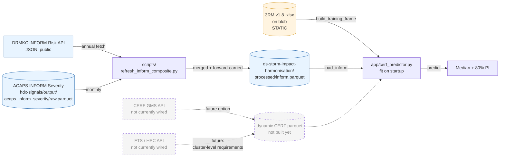

# API & data-source reference

Permanent reference for the external APIs and data sources that feed the CERF
allocation predictor (`app/cerf_predictor.py`) and chapter 02c. Verified
against live endpoints 2026-04-27. If you come back to this in 6 months,
re-verify before relying on edge cases — APIs drift.

| Source | What it gives us | Doc |
|---|---|---|
| **DRMKC INFORM Risk API** | Annual country risk index (HA, VU, CC, INFORM) | [`inform_risk_api.md`](inform_risk_api.md) |
| **ACAPS INFORM Severity** (via OCHA blob) | Monthly country crisis severity 2019+ | this file, below |
| **CERF GMS API** | All CERF allocations + projects (XML/JSON) | [`cerf_gms_api.md`](cerf_gms_api.md) |
| **FTS / HPC API** | HRP requirements + funding flows | [`fts_hpc_api.md`](fts_hpc_api.md) |
| **3RM v1.8 spreadsheet** (on blob) | Static, frozen training set | this file, below |

## Data flow into the predictor



## ACAPS INFORM Severity (via OCHA blob)

We don't hit the ACAPS API directly. The Signals project pre-fetches and
writes a parquet to blob; we read from there.

| | |
|---|---|
| Blob path | `output/acaps_inform_severity/raw.parquet` |
| Stage | `prod` |
| Container | `hdx-signals` |
| Format | Parquet, one row per country-crisis-month |
| Coverage start | 2019-01 |
| Auth needed | requires ACAPS token to refresh upstream — but read-from-blob only needs `DSCI_AZ_BLOB_PROD_SAS` |

Key columns we use: `iso3`, `date`, `country_level`, `inform_severity_index`,
`impact_crisis`, `people_condition`, `complexity`.

**Filtering rules** (applied in `scripts/refresh_inform_composite.py`):
1. Keep `country_level == "Yes"` only — these are pre-aggregated national
   records (ACAPS does the inter-crisis math; sub-crisis rows are detail).
2. Drop rows where `inform_severity_index` is null.
3. Where a country-month still has multiple `country_level=="Yes"` rows
   (8 countries with transitional reclassifications), take the max severity
   per indicator. This matches ACAPS's own multi-crisis aggregation rule.

**Coverage gaps** — Severity is *not* available for every country-month. Two
reasons: (a) it only exists from 2019 onwards; (b) within that window it's
only published when ACAPS is actively tracking a crisis in that country-month.
Several CERF-recipient countries (Comoros, Guinea, Kyrgyzstan, Equatorial
Guinea, Samoa) have no Severity record at all.

## 3RM v1.8 spreadsheet — column gotchas

Source: `ds-storm-impact-harmonisation/raw/CERF 3RM - RR Regression Model - version 1.8.xlsx`,
sheet `MergedData`. 422 rapid-response allocations spanning 2016-01-19 to
2025-08-11. **Static** — no auto-refresh; updates require Rost et al. to
publish a new version. Tail of 2025 is thin (8 allocations vs 39-56 in a
typical year), so v1.8 was clearly frozen mid-2025.

The sheet has THREE distinct dollar-amount columns. They get confused often:

| 3RM column | Typical magnitude | Meaning | API equivalent |
|---|---|---|---|
| `Amount Approved` | $500K – $30M | CERF's final allocation (target variable, → `LogApproved`) | CERF GMS `TotalAmountApproved` |
| `Total Amount Requested` | $500K – $30M | The CERF ask | CERF GMS `CN_AmountRequested` (which is *identical* to approved in 100% of records) |
| **`Total Amount Required`** | **$2M – $2.5B** | **The big one. Used as `LogRequired` (the model's "funding required" feature) — NOT the CERF ask.** Provenance: appears to be a sector- or concept-note-level humanitarian funding figure. **Not in any single CERF GMS or FTS endpoint.** See [`fts_hpc_api.md`](fts_hpc_api.md) for the Flash-Appeal-only partial match. | None — would need parsing from concept-note text or sourcing from Rost directly |

Other gotchas:
- `Total Individual targeted` (singular `Individual`, lowercase `t` — yes, really) is the model's `LogTargeted` source. Maps **exactly** to CERF GMS `TotalIndividualPlanned` in 420/422 rows; rest are within 5%.
- `Date of Most Recent Submission` is the join key for INFORM Severity (year_month).
- 3RM has a `LogTargeted` and `LogRequired` already pre-computed — don't re-derive from raw amount columns unless you're cross-checking.
- Country names are localised English ("Cote d'Ivoire", "oPt", "Swaziland", "Republic of the Sudan"). The ISO3 mapping is hard-coded in `src/datasets/inform.py:COUNTRY_TO_ISO3`.

## Refreshing the blob parquet

```bash
uv run python scripts/refresh_inform_composite.py
```

Idempotent. Treats older Risk years as immutable (only the latest GNAYear
gets re-fetched on each run) and forward-carries the latest published
INFORM Risk to the current calendar year so the app can predict for the
current year despite the API's one-year lag. See
[`inform_risk_api.md`](inform_risk_api.md) for why.

## What's NOT here

- Authentication / SAS-token rotation (see project root `CLAUDE.md`).
- Model methodology (see book chapter `02c-analysis-inform.qmd`).
- Deployment pipeline (see `.github/workflows/...yml` and the comment block at the bottom of that file).
