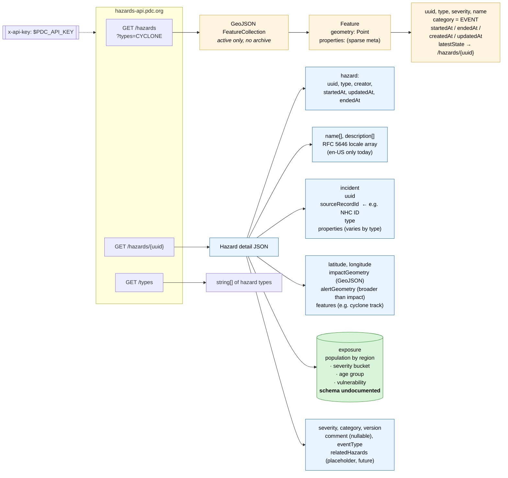

# PDC Hazards API

Pacific Disaster Center's active-hazard feed. Candidate third tropical-cyclone
exposure source alongside ADAM and GDACS.

This file is the **doc-only** reference (built from PDC's `PDC Hazards API
v1.2.0` PDF, last revised 2025-11-13). A second pass with schema details
verified against live responses goes below in [Schema after live exploration](#schema-after-live-exploration)
once we hit the API.

| | |
|---|---|
| Base URL | `https://hazards-api.pdc.org` |
| Auth | `x-api-key` header (env: `PDC_API_KEY`, set in zshrc) |
| Spec version | v1.2.0 |
| Online docs | https://hazards-api.pdc.org/swagger-ui/index.html |
| CORS | echoes request `origin` into `access-control-allow-origin` |
| Maintenance window | Tue 3-5 PM HST (UTC-10), brief outages possible |

## Endpoints

| Endpoint | Purpose | Notes |
|---|---|---|
| `GET /hazards` | List **active** hazards as GeoJSON FeatureCollection | Optional `?types=CYCLONE` (comma-separated, case-insensitive). Bad type returns 400. |
| `GET /hazards/{uuid}` | Full hazard detail | Returns the rich object (see diagram). |
| `GET /types` | Enumerate hazard type strings | Authoritative source for valid `?types=` values. |
| `GET /actuator/info` | API version + deploy date | Unauthenticated. |
| `GET /actuator/health` | `{"status": "UP"}` | Unauthenticated. |

## Response shape (from docs)



Legend: green = the field that drives our integration (population exposure);
blue = rich detail object; orange = sparse list-view properties.

## Severity (ordered, lowest to highest)

| Level | Meaning |
|---|---|
| `INFORMATION` | Limited or minor impacts possible. |
| `ADVISORY` | Limited or minor impacts possible; exercise caution. |
| `WATCH` | Adverse or significant impacts possible; monitor and prepare. |
| `WARNING` | Adverse or significant impacts imminent or occurring; act now. |

## Hazard types relevant to this project

`CYCLONE` (tropical cyclone, includes hurricanes and typhoons) is the primary
target. Adjacent types worth knowing about: `STORM`, `SEVEREWEATHER`,
`HIGHWIND`, `HIGHSURF`, `FLOOD`, `TORNADO`. Full list comes from `/types`.

## Caveats from the PDF (verify on first live call)

1. **RICHTER vs D2P2 backends.** PDC is migrating hazards from a legacy
   system (D2P2) to a new one (RICHTER). Only RICHTER hazards include all
   documented fields; D2P2 hazards may be missing several. Check the
   `creator` field. Cyclone migration status is unknown until we look.
2. **Active hazards only.** `/hazards` returns currently-active events.
   The PDF documents no historical / archive endpoint. For a back-catalogue
   that aligns with CERF (2006-present) we will need either (a) PDC's
   confirmation of an archive feed, or (b) a daily-poll-and-accumulate
   strategy similar to the GDACS daily monitor pipeline.
3. **`exposure` schema is not documented.** PDF says "more details will be
   provided later" for both `exposure` and `incident.properties`. We have
   to discover the shape from a live response.
4. **`relatedHazards` is a placeholder.** Documented but not yet populated.
5. **`latestState` is a URL, not an object** in the FeatureCollection
   response. Follow it (or call `/hazards/{uuid}` directly) for full detail.
6. **Localized arrays.** `name` and `description` are arrays of `{locale,
   value}` objects, not plain strings. Today only `en-US` is populated.

## Schema after live exploration

Live probes ran **2026-04-27** against API **v1.2.0** (build dated 2026-04-21)
using `PDC_API_KEY` from shell env. UUIDs cited below are real and
re-fetchable from the same endpoints. Where the PDF and live behaviour
disagree, **trust this section.**

### PDF discrepancies

| PDF says | Live reality | Why it matters |
|---|---|---|
| `GET /types` | `GET /hazards/types` returns `[{id, name}, …]`; the `/types` path returns 500 `"No static resource types."` | Code generated from the PDF will 500 on first call |
| No archive endpoint | `GET /hazards?status=ARCHIVED` works (also `?active=false`) | But archive is shallow — see below |
| `name`/`description` use RFC 5646 (`en-US`) | Live `locale` is `en` (no region subtag) | Don't filter on `en-US` |
| List-view `category = EVENT` | Live cyclone has `category = "RESPONSE"` | `category` is a status enum, not always `EVENT` |
| (silent) | `endedAt = 32503679999` (year-2999 epoch sentinel) for active hazards | Use `< 32503679999` to detect "actually ended" |
| (silent) | Detail object's top-level `uuid` ≠ `hazard.uuid` | Top-level `uuid` is a state/version ID. Use `hazard.uuid` as the stable hazard identifier. |
| (silent) | Many scalar fields are wrapped in Avro union envelopes (`{"string": v}`, `{"long": v}`, …) | Need an unwrap helper before downstream code touches the detail object |
| (silent) | `?startedAfter` / `?updatedAfter` query params are silently ignored | No incremental-poll filter — must dedupe locally by `uuid` + `updatedAt` |

### Working endpoint inventory

| Endpoint | Auth | Returns | Notes |
|---|---|---|---|
| `GET /actuator/info` | none | `{build: {artifact, name, time, version, group}}` | Confirmed v1.2.0, deploy 2026-04-21 |
| `GET /actuator/health` | none | `{status: "UP"}` | |
| `GET /hazards/types` | required | `[{id, name}, …]` (33 entries — full list below) | Authoritative source for `?types=` values |
| `GET /hazards` | required | GeoJSON FeatureCollection of active hazards | `?types=CYCLONE` filter works (case-insensitive). `?status=ARCHIVED` returns archive instead. Date filters silently ignored. |
| `GET /hazards/{uuid}` | required | Detail object (see below) | Works for both active and archived hazards |

**No pagination.** `/hazards?status=ARCHIVED` returns all 577 features in a
single ~340 KB response. No `Link`, `X-Total-Count`, or cursor headers. If the
archive grows substantially, we have no documented way to page.

### Hazard types (full enumeration from `/hazards/types`)

```json
[
  {"id": "ACCIDENT", "name": "Accident"},
  {"id": "ACTIVESHOOTER", "name": "Active Shooter"},
  {"id": "AVALANCHE", "name": "Avalanche"},
  {"id": "BIOMEDICAL", "name": "Biomedical"},
  {"id": "CIVILUNREST", "name": "Civil Unrest"},
  {"id": "COMBAT", "name": "Combat"},
  {"id": "CONFLICT", "name": "Conflict"},
  {"id": "CYBER", "name": "Cyber"},
  {"id": "CYCLONE", "name": "Tropical Cyclone"},
  {"id": "DROUGHT", "name": "Drought"},
  {"id": "EARTHQUAKE", "name": "Earthquake"},
  {"id": "EQUIPMENT", "name": "Equipment"},
  {"id": "EXTREMETEMPERATURE", "name": "Extreme Temperature"},
  {"id": "FLOOD", "name": "Flood"},
  {"id": "HIGHWIND", "name": "High Wind"},
  {"id": "HIGHSURF", "name": "High Surf"},
  {"id": "INCIDENT", "name": "Incident"},
  {"id": "LANDSLIDE", "name": "Landslide"},
  {"id": "MANMADE", "name": "Man-Made"},
  {"id": "MARINE", "name": "Marine"},
  {"id": "OCCURRENCE", "name": "Occurrence"},
  {"id": "POLITICALCONFLICT", "name": "Political Conflict"},
  {"id": "SEVEREWEATHER", "name": "Severe Weather"},
  {"id": "STORM", "name": "Storm"},
  {"id": "TERRORISM", "name": "Terrorism"},
  {"id": "TORNADO", "name": "Tornado"},
  {"id": "TSUNAMI", "name": "Tsunami"},
  {"id": "UNIT", "name": "Unit"},
  {"id": "UNKNOWN", "name": "Unknown"},
  {"id": "VOLCANO", "name": "Volcanic Eruption"},
  {"id": "WEAPONS", "name": "Weapons"},
  {"id": "WILDFIRE", "name": "Wildfire"},
  {"id": "WINTERSTORM", "name": "Winter Storm"}
]
```

The list spans many non-natural-hazard types (`ACCIDENT`, `ACTIVESHOOTER`,
`COMBAT`, `CYBER`, `TERRORISM`, `WEAPONS`). For our scope, primary filter is
`CYCLONE`; adjacent natural-hazard types are `STORM`, `SEVEREWEATHER`,
`HIGHWIND`, `HIGHSURF`, `FLOOD`, `TORNADO`, `WINTERSTORM`.

### Active list-view shape

`GET /hazards?types=CYCLONE` (real response, single active cyclone at probe time):

```json
{
  "type": "FeatureCollection",
  "features": [
    {
      "geometry": {"type": "Point", "coordinates": [145.58305, 15.17017]},
      "type": "Feature",
      "properties": {
        "uuid": "e621323a-1d6e-4b3c-9413-e72800dab5d4",
        "name": "Tropical Storm - Sinlaku",
        "type": "CYCLONE",
        "severity": "WARNING",
        "category": "RESPONSE",
        "createdAt": 1775700965,
        "startedAt": 1775692800,
        "updatedAt": 1776702621,
        "endedAt": 32503679999,
        "latestState": "https://hazards-api.pdc.org/hazards/e621323a-1d6e-4b3c-9413-e72800dab5d4"
      }
    }
  ]
}
```

Note `category = "RESPONSE"` and the year-2999 `endedAt` sentinel.

### Detail object: top-level shape

`GET /hazards/{uuid}` returns a flat top-level map (not nested under
`hazard:` as the PDF diagram suggested). Top-level keys observed for
`e621323a-…` (Sinlaku, ~50 KB response):

| Key | Type | Notes |
|---|---|---|
| `uuid` | string | **State/version UUID — differs from `hazard.uuid`.** Use `hazard.uuid` as the stable identifier. |
| `version` | int | Version counter |
| `severity` | string | Same enum as list view |
| `category` | string | `RESPONSE` for cyclones (so far) |
| `eventType` | string | Observed `COMPLETE` |
| `latitude`, `longitude` | float | Centre of hazard |
| `createdAt` | int (epoch s) | |
| `comment` | `{"string": ""}` | Avro envelope, see below |
| `name` | array of `{locale, value}` | Localized; `en` only |
| `description` | array of `{locale, value}` | Localized; `en` only |
| `hazard` | object | Stable IDs and timestamps — `{uuid, type, creator, source, startedAt, updatedAt, endedAt}` |
| `incident` | object | Source record + flat key/value snapshot — see below |
| `exposure` | object | **Population/capital impact** — see below; this is the harmonisation target |
| `impactGeometry` | `{id, geoJson}` | GeoJSON Polygon of impact swath (Sinlaku has 347 vertices) |
| `alertGeometry` | `{…/GeometryReference, geoJson}` | GeoJSON Polygon of alert area (broader than impact) |
| `features` | `{…/GeometryReference, geoJson}` | GeoJSON FeatureCollection of incident points (and likely forecast track for richer cyclones) |
| `relatedHazards` | `{"array": []}` | Empty placeholder, as PDF said |

#### Avro union envelopes (schema gotcha)

Many scalar fields come wrapped in single-key dicts of the form
`{"<avro_type>": value}`. Examples from the live Sinlaku response:

```json
{
  "hazard": {
    "creator": {"string": "RICHTER"},
    "endedAt": {"long": 32503679999}
  },
  "comment": {"string": ""},
  "relatedHazards": {"array": []}
}
```

Inside `incident.snapshot.properties.map` *every* field uses this envelope —
the entire snapshot is `{key: {<type>: value}}` end-to-end. A small recursive
unwrap helper that, when given a dict with exactly one key matching
`string|long|int|double|float|boolean|array`, returns the inner value, will
normalize this before downstream code touches it.

#### `incident` shape

```json
{
  "uuid": "03726c63-a8b9-4403-b5f0-442b5f8487b5",
  "type": "CYCLONE",
  "sourceId": 3000,
  "sourceRecordId": "bfe7f06d-d539-415f-a84a-324a9b15b8e0",
  "snapshot": {
    "properties": {
      "map": {
        "sourceName": {"string": "PDC Manual Hazard"},
        "sourceUrl": {"string": ""},
        "sourceResourceLocations": {"string": "[{\"sourceName\":\"PDC Manual Hazard\",\"sourceUrl\":\"\"}]"},
        "rawMessage": {"string": ""},
        "incidentLatitude": {"double": 15.17017},
        "incidentLongitude": {"double": 145.58305},
        "eventDate": {"string": "2026-04-09T00:00:00Z"},
        "endDate": {"string": "2999-12-31T23:59:59Z"},
        "...": "...30+ more flat key/value entries..."
      }
    }
  },
  "message": {
    "org.pdc.apps.richter.models.avro.shared.StorageReference": {
      "id": "CYCLONE/2026/Data/03726c63-.../incident.json"
    }
  }
}
```

`incident.sourceRecordId` for live Sinlaku is a PDC-internal UUID, not an NHC
ATCF / JTWC ID. The `sourceName` is `"PDC Manual Hazard"` — this storm was
manually entered, not ingested from RSMC. **So the path from PDC → IBTrACS
SID is not yet confirmed.** It may live in `rawMessage`, `sourceUrl`, or
`sourceResourceLocations` for an RSMC-sourced cyclone; revisit when one
appears in the feed.

#### `exposure.data` shape (the harmonisation target)

Top-level keys under `exposure.data`:

| Key | Description |
|---|---|
| `population` | Aggregate population impact (not per-country) |
| `capital` | Aggregate capital impact `{total, school, hospital}` |
| `totalByCountry` | **Per-country breakdown — array, the join target for harmonisation** |
| `totalByAdmin` | Admin-level breakdown — same shape as `totalByCountry` |
| `exposureLevels` | Severity buckets — `[{level, exposureDescription, data}]` |
| `foodNeeds` / `waterNeeds` / `wasteNeeds` / `shelterNeeds` | Aggregate humanitarian-needs estimates with units |

Each `population` block has very granular age + vulnerability sub-fields:

```
population.{
  total, total0_4, total5_9, total10_14, total15_19, total20_24,
  total25_29, total30_34, total35_39, total40_44, total45_49,
  total50_54, total55_59, total60_64, total65_69, total70_74,
  total75_79, total80_84, total85_89, total90_94, total95_99,
  total100AndOver,
  total0_14, total15_64, total65_Plus,
  vulnerable, vulnerable0_14, vulnerable15_64, vulnerable65_Plus,
  households
}
```

Each leaf is a `{value, valueFormatted, valueFormattedNoTrunc, valueRounded}`
quad. `value` is the float; `valueFormatted` is human-readable
("3.13 Billion"); `valueFormattedNoTrunc` is comma-grouped without truncation.

**Real per-country entry** — Sinlaku has all-zero exposure (still pre-landfall),
so this comes from the Puerto Rico flood `9175d060-…` for a populated example:

```json
{
  "country": "PRI",
  "admin0": "Puerto Rico",
  "admin1": null,
  "admin2": null,
  "population": {
    "total": {"value": 35800.0, "valueRounded": 35800.0, "valueFormatted": "35,800", "valueFormattedNoTrunc": "35,800"},
    "total0_14": {"value": 4296.0, "valueFormatted": "4,296", "valueFormattedNoTrunc": "4,296", "valueRounded": 4296},
    "total15_64": {"value": 22826.08, "valueFormatted": "22,826", "valueFormattedNoTrunc": "22,826.08", "valueRounded": 22826}
  },
  "capital": {
    "total": {"value": 3138528000.0, "valueFormatted": "3.13 Billion", "valueFormattedNoTrunc": "3,138,528,000", "valueRounded": 3130000000.0},
    "school": {"value": ..., "valueFormatted": ...},
    "hospital": {"value": ..., "valueFormatted": ...}
  },
  "foodNeedsUnit": "CAL",
  "foodNeeds": {"value": 32970000.0, "valueFormatted": "32.9 Million"},
  "waterNeedsUnit": "liter",
  "waterNeeds": {"value": 47100.0, "valueFormatted": "47,100"},
  "wasteNeedsUnit": "100 liter",
  "wasteNeeds": {"value": 1570.0, "valueFormatted": "1,570"},
  "shelterNeedsUnit": "sq meters",
  "shelterNeeds": {"value": 54165.0, "valueFormatted": "54,100"}
}
```

**`country` is ISO3** — direct join with our existing GDACS/CERF tables. ✓

`totalByAdmin[]` has the same shape plus populated `admin1`/`admin2` for
sub-national aggregates (Puerto Rico flood has admin1/admin2 null because
the storm covers a single admin0 only).

**`exposureLevels` shape:**

```json
{
  "level": "1",
  "exposureDescription": "MODERATE",
  "data": { /* same shape as exposure.data above (population, capital, foodNeeds, ...) */ }
}
```

For the PR flood `exposureLevels` has one entry (level "1" / "MODERATE").
For Sinlaku also one entry (level "1" / "Moderate Damage Expected") with
all-zero values — the storm is still mostly forecast and exposure compute
hasn't populated. **The cyclone wind-band semantics — i.e. whether a
landfalled cyclone has multiple `exposureLevels` entries keyed to wind
thresholds (a la GDACS `pop_34kt`/`pop_64kt` cumulative bands or ADAM
`pop_60/90/120kmh` discrete bands) — cannot be confirmed from these two
samples.** Revisit when a landfalled cyclone is in the feed.

### Archive characterization

Total: **577 archived hazards** as of 2026-04-27.
Date range: **2024-03-19 → 2026-04-29** (≈25 months).
Delivered as a single ~340 KB JSON response, no pagination.

By type:

| Type | Count | Type | Count |
|---|---:|---|---:|
| FLOOD | 182 | EXTREMETEMPERATURE | 9 |
| WILDFIRE | 125 | ACCIDENT | 6 |
| HIGHWIND | 68 | WINTERSTORM | 5 |
| STORM | 65 | CIVILUNREST | 4 |
| SEVEREWEATHER | 42 | AVALANCHE | 4 |
| COMBAT | 19 | DROUGHT | 4 |
| VOLCANO | 14 | ACTIVESHOOTER | 3 |
| LANDSLIDE | 12 | BIOMEDICAL | 3 |
| EARTHQUAKE | 3 | TERRORISM | 3 |
| TORNADO | 2 | MANMADE | 2 |
| MARINE | 1 | **CYCLONE** | **1** |

The single archived CYCLONE is Sinlaku — the same storm currently active.
**PDC's archive is essentially empty for tropical cyclones.** Combined with
the ~25-month depth, this means PDC can supply zero historical CERF-window
cyclones (CERF starts 2006). Daily-poll-and-accumulate from the current
moment onward is the only viable strategy.

**Date filters** (`?startedAfter=YYYY-MM-DD`, `?updatedAfter=<epoch>`,
`?endedAfter=…`) are silently ignored — they don't return errors but the
response is byte-identical to the unfiltered call. So incremental polling
means: pull the full list and dedupe by `(uuid, updatedAt)` against
locally-stored state.

### Sample UUIDs for re-fetching

| Hazard | UUID | Useful for |
|---|---|---|
| Tropical Storm Sinlaku (active) | `e621323a-1d6e-4b3c-9413-e72800dab5d4` | Live cyclone schema (RICHTER, manual source, all-zero exposure pre-landfall) |
| Flood, Northern Puerto Rico (archived) | `9175d060-4f6b-49f9-9335-950dfbcb0caa` | Populated `totalByCountry` (PRI) — exposure-schema reference |
| Sinlaku incident UUID (inside detail) | `03726c63-a8b9-4403-b5f0-442b5f8487b5` | Cross-reference for `incident.uuid` semantics |

### Open questions still unresolved

1. **IBTrACS-join path for cyclones.** Sinlaku is a manual hazard with no
   RSMC source, so we couldn't confirm whether `incident.sourceRecordId`,
   `incident.snapshot.properties.map.sourceUrl`, `rawMessage`, or
   `sourceResourceLocations` carries an NHC ATCF / JTWC ID for non-manual
   cyclones. Revisit when a non-manual cyclone appears in the feed.
2. **Cyclone-specific `exposureLevels` structure.** Single-level / all-zero
   for both samples seen. Need a landfalled cyclone observation to confirm
   whether multiple bucket entries appear and what `level` values map to
   (wind thresholds? Saffir-Simpson?).
3. **Archive retention policy.** 577 hazards over ~25 months ≈ 23/month.
   Whether older hazards age out, or the archive grows monotonically, isn't
   knowable from a single snapshot. Worth asking PDC directly or polling the
   archive over a few weeks to compare.
4. **Multi-country events.** All exposure samples we have happen to be
   single-country. The shape `totalByCountry: [{country, admin0, …}, …]`
   strongly suggests per-country rows for cross-border events, but not yet
   verified live.

### Revised implications for PDC loader design

Replaces / supersedes the implications above this section.

1. **Daily-poll-and-accumulate is the only viable design.** Archive is
   ~25 months deep with 1 cyclone. Pattern matches the GDACS *daily monitor*
   in `src/gdacs_monitor_email.py` more than the GDACS *historical exposure*
   pipeline.
2. **Schema target alignment is favourable.** PDC's
   `totalByCountry[].country` is ISO3, joining cleanly with the existing
   `(event_id, iso3, ...)` GDACS shape. Map `population.total.value` →
   `pop_total`; map per-`exposureLevels[].level` populations to threshold
   columns once cyclone semantics are confirmed.
3. **Avro envelope unwrap is required at load time.** Recursive unwrap on
   `{"<scalar_type>": v}` and `{"array": [...]}` dicts.
4. **IBTrACS join deferred.** Without an RSMC-sourced cyclone in the feed
   yet, we can't lock down SID resolution. Build the loader to capture
   `incident.sourceRecordId` *and* the full `incident.snapshot.properties.map`
   so we can revisit join logic without re-fetching.
5. **Use `hazard.uuid` (not the top-level `uuid`) as the stable event key.**
   Top-level `uuid` is a state/version ID and changes with updates.

## Integration target: existing ADAM and GDACS exposure schemas

PDC's exposure output needs to align with what's already wired into the book
and CERF analysis. Findings below are from a code survey on 2026-04-27.
**Verify file:line references against current code before relying on them.**

### ADAM
| | |
|---|---|
| Loader | None in `src/datasets/`; loaded ad-hoc in notebooks |
| Blob | `ds-cyclone-exposure/adam_historical_national_exposure.csv` |
| Unit | one row per (sid, iso3) |
| Population columns | `pop_60kmh`, `pop_90kmh`, `pop_120kmh` |
| Semantics | **bands** (60-90, 90-120, 120+ km/h), not cumulative |
| Coverage | 2023-2025 only (minimal CERF overlap) |
| Schema doc | `book/03-appendix-adam-gdacs.qmd:34-51` |

### GDACS (historical exposure pipeline)
| | |
|---|---|
| Loader | `src/datasets/gdacs.py` → `get_timeline`, `get_impact_by_country`, `build_exposure_table` |
| Build script | `scripts/rebuild_gdacs_historical_exposure.py` |
| Output blob | `ds-storm-impact-harmonisation/raw/gdacs/gdacs_historical_adm0_exposure_v2_NOAA.csv` |
| Unit | one row per (event_id, iso3) |
| Columns | `event_id`, `episode_id`, `iso3`, `country_name`, `pop_34kt`, `pop_64kt`, `storm_name`, `from_date`, `alert_level` |
| Semantics | **cumulative** wind thresholds in knots (`pop_34kt` = pop within 34kt+ swath) |
| SID join | `gdacs.join_ibtracs()` (gdacs.py around line 375) |
| Schema doc | `book/03-appendix-adam-gdacs.qmd:168-179` |

### GDACS (daily monitor email — separate, not for harmonisation)
| | |
|---|---|
| Module | `src/gdacs_monitor_email.py` |
| Reads | `ds-storm-impact-harmonisation/processed/adm0_ibtracs_exp_all.parquet` (OCHA in-house IBTrACS-based product, not GDACS-derived) |
| Purpose | Daily email rendering only |

Don't confuse this with the historical GDACS pipeline above; they share a
name but not a data source.

### CERF storms (the canonical event list to join against)
| | |
|---|---|
| Loader | `src/datasets/cerf.py` |
| Join key | IBTrACS `sid` + `iso3` |
| Mapping table | `CERFCODE_TO_SID` hard-coded (cerf.py around line 39) |
| Candidate-SID lookup | `lookup_candidate_sids()` extracts date from `sid[:7]` |

### Implications for PDC loader design
1. **Schema target.** Mirror GDACS' `(event_id, iso3, pop_<threshold>, ...)` shape so PDC slots into the same merge logic the book already uses. ADAM's band semantics differ; harmonisation chapter (07) deals with the conversion.
2. **SID join.** PDC has its own UUID, not an IBTrACS SID. Build a `join_ibtracs()` analog: most likely path is `incident.sourceRecordId` → NHC ATCF ID → IBTrACS lookup. Confirm during exploration.
3. **Wind thresholds.** Pick whichever PDC reports natively. If PDC bins by Saffir-Simpson category instead of m/s or kt, document the conversion explicitly rather than silently translating.
4. **Active-only feed risk.** If PDC has no archive endpoint, the "historical" pipeline becomes a daily-poll-and-accumulate, similar to the GDACS daily monitor. That's a substantively different deliverable from ADAM/GDACS historical CSVs and worth flagging early.
5. **No prior PDC code in the repo** as of branch creation — fresh slate, no scaffolding to inherit.

## Worktree / branch context for this work

This branch (`add-pdc-exposure`) lives in a separate worktree to avoid
interfering with parallel Claude sessions on `merge-cerf-exposure`:

```
/Users/zackarno/Documents/CHD/repos/ds-storm-impact-harmonisation       merge-cerf-exposure  (other sessions)
/Users/zackarno/Documents/CHD/repos/ds-storm-impact-harmonisation-pdc   add-pdc-exposure     (PDC work, this directory)
```

Both share one `.git`, so commits and fetches are visible across.

Credentials: project has **no `.env` file**; `PDC_API_KEY`,
`DSCI_AZ_BLOB_DEV_SAS`, and `DSCI_AZ_BLOB_PROD_SAS` all come from shell
env (zshrc).

