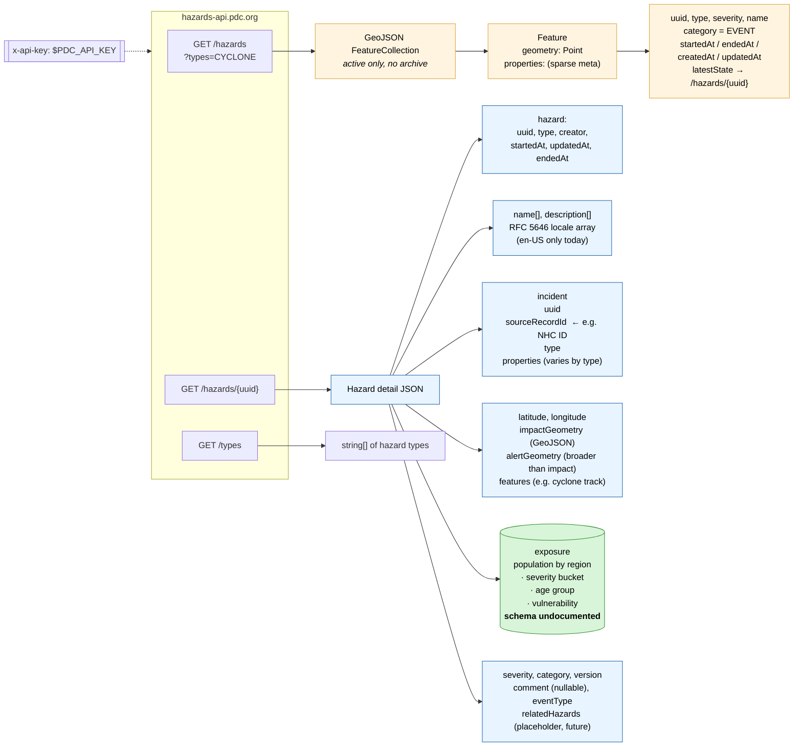

# PDC Hazards API

Pacific Disaster Center's active-hazard feed. Candidate third tropical-cyclone
exposure source alongside ADAM and GDACS.

This file is the **doc-only** reference (built from PDC's `PDC Hazards API
v1.2.0` PDF, last revised 2025-11-13). A second pass with schema details
verified against live responses goes below in [Schema after live exploration](#schema-after-live-exploration)
once we hit the API.

| | |
|---|---|
| Base URL | `https://hazards-api.pdc.org` |
| Auth | `x-api-key` header (env: `PDC_API_KEY`, set in zshrc) |
| Spec version | v1.2.0 |
| Online docs | https://hazards-api.pdc.org/swagger-ui/index.html |
| CORS | echoes request `origin` into `access-control-allow-origin` |
| Maintenance window | Tue 3-5 PM HST (UTC-10), brief outages possible |

## Endpoints

| Endpoint | Purpose | Notes |
|---|---|---|
| `GET /hazards` | List **active** hazards as GeoJSON FeatureCollection | Optional `?types=CYCLONE` (comma-separated, case-insensitive). Bad type returns 400. |
| `GET /hazards/{uuid}` | Full hazard detail | Returns the rich object (see diagram). |
| `GET /types` | Enumerate hazard type strings | Authoritative source for valid `?types=` values. |
| `GET /actuator/info` | API version + deploy date | Unauthenticated. |
| `GET /actuator/health` | `{"status": "UP"}` | Unauthenticated. |

## Response shape (from docs)


```mermaid
flowchart LR
    AUTH[["x-api-key: $PDC_API_KEY"]]

    subgraph EPS["hazards-api.pdc.org"]
        EP1["GET /hazards<br/>?types=CYCLONE"]
        EP2["GET /hazards/{uuid}"]
        EP3["GET /types"]
    end

    AUTH -.-> EPS

    EP1 --> ACTIVE["GeoJSON FeatureCollection<br/><i>active only, no archive</i>"]
    EP2 --> DETAIL["Hazard detail JSON"]
    EP3 --> TYPES["string[] of hazard types"]

    ACTIVE --> FEATURE["Feature<br/>geometry: Point<br/>properties: (sparse meta)"]
    FEATURE --> PROPS["uuid, type, severity, name<br/>category = EVENT<br/>startedAt / endedAt /<br/>createdAt / updatedAt<br/>latestState → /hazards/{uuid}"]

    DETAIL --> D_BRIEF["hazard:<br/>uuid, type, creator,<br/>startedAt, updatedAt, endedAt"]
    DETAIL --> D_LOC["name[], description[]<br/>RFC 5646 locale array<br/>(en-US only today)"]
    DETAIL --> D_INC["incident<br/>uuid<br/>sourceRecordId  ← e.g. NHC ID<br/>type<br/>properties (varies by type)"]
    DETAIL --> D_GEO["latitude, longitude<br/>impactGeometry (GeoJSON)<br/>alertGeometry (broader than impact)<br/>features (e.g. cyclone track)"]
    DETAIL --> D_EXP[("exposure<br/>population by region<br/>· severity bucket<br/>· age group<br/>· vulnerability<br/><b>schema undocumented</b>")]
    DETAIL --> D_META["severity, category, version<br/>comment (nullable), eventType<br/>relatedHazards (placeholder, future)"]

    classDef rich fill:#e8f4ff,stroke:#2166ac,color:#000
    classDef sparse fill:#fff4e0,stroke:#d9a43a,color:#000
    classDef key fill:#d9f5d9,stroke:#2a8a2a,color:#000
    classDef tbd fill:#f5f5f5,stroke:#888,color:#444,stroke-dasharray: 5 5

    class DETAIL,D_BRIEF,D_LOC,D_INC,D_GEO,D_META rich
    class ACTIVE,FEATURE,PROPS sparse
    class D_EXP key
```

Legend: green = the field that drives our integration (population exposure);
blue = rich detail object; orange = sparse list-view properties.

## Severity (ordered, lowest to highest)

| Level | Meaning |
|---|---|
| `INFORMATION` | Limited or minor impacts possible. |
| `ADVISORY` | Limited or minor impacts possible; exercise caution. |
| `WATCH` | Adverse or significant impacts possible; monitor and prepare. |
| `WARNING` | Adverse or significant impacts imminent or occurring; act now. |

## Hazard types relevant to this project

`CYCLONE` (tropical cyclone, includes hurricanes and typhoons) is the primary
target. Adjacent types worth knowing about: `STORM`, `SEVEREWEATHER`,
`HIGHWIND`, `HIGHSURF`, `FLOOD`, `TORNADO`. Full list comes from `/types`.

## Caveats from the PDF (verify on first live call)

1. **RICHTER vs D2P2 backends.** PDC is migrating hazards from a legacy
   system (D2P2) to a new one (RICHTER). Only RICHTER hazards include all
   documented fields; D2P2 hazards may be missing several. Check the
   `creator` field. Cyclone migration status is unknown until we look.
2. **Active hazards only.** `/hazards` returns currently-active events.
   The PDF documents no historical / archive endpoint. For a back-catalogue
   that aligns with CERF (2006-present) we will need either (a) PDC's
   confirmation of an archive feed, or (b) a daily-poll-and-accumulate
   strategy similar to the GDACS daily monitor pipeline.
3. **`exposure` schema is not documented.** PDF says "more details will be
   provided later" for both `exposure` and `incident.properties`. We have
   to discover the shape from a live response.
4. **`relatedHazards` is a placeholder.** Documented but not yet populated.
5. **`latestState` is a URL, not an object** in the FeatureCollection
   response. Follow it (or call `/hazards/{uuid}` directly) for full detail.
6. **Localized arrays.** `name` and `description` are arrays of `{locale,
   value}` objects, not plain strings. Today only `en-US` is populated.

## Schema after live exploration

Live probes ran **2026-04-27** against API **v1.2.0** (build dated 2026-04-21)
using `PDC_API_KEY` from shell env. UUIDs cited below are real and
re-fetchable from the same endpoints. Where the PDF and live behaviour
disagree, **trust this section.**

### PDF discrepancies

| PDF says | Live reality | Why it matters |
|---|---|---|
| `GET /types` | `GET /hazards/types` returns `[{id, name}, …]`; the `/types` path returns 500 `"No static resource types."` | Code generated from the PDF will 500 on first call |
| `/hazards` returns active hazards only; no archive | Wrong on both counts. There is no archive endpoint, and `/hazards` returns hazards PDC still considers open — see the corrected retention model below (the earlier "~30-day tail" claim was wrong). The `status` query parameter is silently ignored — `?status=ARCHIVED`, `?status=ACTIVE`, and `?status=BOGUSVALUE` all return roughly the same dataset. | What looks like an "archive" is just the default behaviour — see "What `/hazards` actually returns" below |
| `name`/`description` use RFC 5646 (`en-US`) | Live `locale` is `en` (no region subtag) | Don't filter on `en-US` |
| List-view `category = EVENT` | Live cyclone has `category = "RESPONSE"` | `category` is a status enum, not always `EVENT` |
| (silent) | `endedAt = 32503679999` (= `2999-12-31T23:59:59 UTC`, a sentinel for "still active") | Use `< 32503679999` to detect "actually ended" |
| (silent) | Detail object's top-level `uuid` ≠ `hazard.uuid` | Top-level `uuid` is a state/version ID. Use `hazard.uuid` as the stable hazard identifier. |
| (silent) | Many scalar fields are wrapped in Avro union envelopes (`{"string": v}`, `{"long": v}`, …) | Need an unwrap helper before downstream code touches the detail object |
| (silent) | `?startedAfter` / `?updatedAfter` / `?status=` query params are all silently ignored | No incremental-poll filter — must dedupe locally by `(uuid, updatedAt)` |

### Working endpoint inventory

| Endpoint | Auth | Returns | Notes |
|---|---|---|---|
| `GET /actuator/info` | none | `{build: {artifact, name, time, version, group}}` | Confirmed v1.2.0, deploy 2026-04-21 |
| `GET /actuator/health` | none | `{status: "UP"}` | |
| `GET /hazards/types` | required | `[{id, name}, …]` (33 entries — full list below) | Authoritative source for `?types=` values |
| `GET /hazards` | required | GeoJSON FeatureCollection of hazards PDC still considers open (no meaningful post-end tail — see corrected retention model) | `?types=CYCLONE` filter works (case-insensitive). `?status=` and date filters are silently ignored — see "What `/hazards` actually returns" below. |
| `GET /hazards/{uuid}` | required | Detail object (see below) | Works for both active and archived hazards |

**No pagination.** `/hazards?status=ARCHIVED` returns all 577 features in a
single ~340 KB response. No `Link`, `X-Total-Count`, or cursor headers. If the
archive grows substantially, we have no documented way to page.

### Hazard types (full enumeration from `/hazards/types`)

```json
[
  {"id": "ACCIDENT", "name": "Accident"},
  {"id": "ACTIVESHOOTER", "name": "Active Shooter"},
  {"id": "AVALANCHE", "name": "Avalanche"},
  {"id": "BIOMEDICAL", "name": "Biomedical"},
  {"id": "CIVILUNREST", "name": "Civil Unrest"},
  {"id": "COMBAT", "name": "Combat"},
  {"id": "CONFLICT", "name": "Conflict"},
  {"id": "CYBER", "name": "Cyber"},
  {"id": "CYCLONE", "name": "Tropical Cyclone"},
  {"id": "DROUGHT", "name": "Drought"},
  {"id": "EARTHQUAKE", "name": "Earthquake"},
  {"id": "EQUIPMENT", "name": "Equipment"},
  {"id": "EXTREMETEMPERATURE", "name": "Extreme Temperature"},
  {"id": "FLOOD", "name": "Flood"},
  {"id": "HIGHWIND", "name": "High Wind"},
  {"id": "HIGHSURF", "name": "High Surf"},
  {"id": "INCIDENT", "name": "Incident"},
  {"id": "LANDSLIDE", "name": "Landslide"},
  {"id": "MANMADE", "name": "Man-Made"},
  {"id": "MARINE", "name": "Marine"},
  {"id": "OCCURRENCE", "name": "Occurrence"},
  {"id": "POLITICALCONFLICT", "name": "Political Conflict"},
  {"id": "SEVEREWEATHER", "name": "Severe Weather"},
  {"id": "STORM", "name": "Storm"},
  {"id": "TERRORISM", "name": "Terrorism"},
  {"id": "TORNADO", "name": "Tornado"},
  {"id": "TSUNAMI", "name": "Tsunami"},
  {"id": "UNIT", "name": "Unit"},
  {"id": "UNKNOWN", "name": "Unknown"},
  {"id": "VOLCANO", "name": "Volcanic Eruption"},
  {"id": "WEAPONS", "name": "Weapons"},
  {"id": "WILDFIRE", "name": "Wildfire"},
  {"id": "WINTERSTORM", "name": "Winter Storm"}
]
```

The list spans many non-natural-hazard types (`ACCIDENT`, `ACTIVESHOOTER`,
`COMBAT`, `CYBER`, `TERRORISM`, `WEAPONS`). For our scope, primary filter is
`CYCLONE`; adjacent natural-hazard types are `STORM`, `SEVEREWEATHER`,
`HIGHWIND`, `HIGHSURF`, `FLOOD`, `TORNADO`, `WINTERSTORM`.

### Active list-view shape

`GET /hazards?types=CYCLONE` (real response, single active cyclone at probe time):

```json
{
  "type": "FeatureCollection",
  "features": [
    {
      "geometry": {"type": "Point", "coordinates": [145.58305, 15.17017]},
      "type": "Feature",
      "properties": {
        "uuid": "e621323a-1d6e-4b3c-9413-e72800dab5d4",
        "name": "Tropical Storm - Sinlaku",
        "type": "CYCLONE",
        "severity": "WARNING",
        "category": "RESPONSE",
        "createdAt": 1775700965,
        "startedAt": 1775692800,
        "updatedAt": 1776702621,
        "endedAt": 32503679999,
        "latestState": "https://hazards-api.pdc.org/hazards/e621323a-1d6e-4b3c-9413-e72800dab5d4"
      }
    }
  ]
}
```

Note `category = "RESPONSE"` and the sentinel `endedAt = 32503679999`
(= `2999-12-31T23:59:59 UTC`, used to mark "still active").

### Detail object: top-level shape

`GET /hazards/{uuid}` returns a flat top-level map (not nested under
`hazard:` as the PDF diagram suggested). Top-level keys observed for
`e621323a-…` (Sinlaku, ~50 KB response):

| Key | Type | Notes |
|---|---|---|
| `uuid` | string | **State/version UUID — differs from `hazard.uuid`.** Use `hazard.uuid` as the stable identifier. |
| `version` | int | Version counter |
| `severity` | string | Same enum as list view |
| `category` | string | `RESPONSE` for cyclones (so far) |
| `eventType` | string | Observed `COMPLETE` |
| `latitude`, `longitude` | float | Centre of hazard |
| `createdAt` | int (epoch s) | |
| `comment` | `{"string": ""}` | Avro envelope, see below |
| `name` | array of `{locale, value}` | Localized; `en` only |
| `description` | array of `{locale, value}` | Localized; `en` only |
| `hazard` | object | Stable IDs and timestamps — `{uuid, type, creator, source, startedAt, updatedAt, endedAt}` |
| `incident` | object | Source record + flat key/value snapshot — see below |
| `exposure` | object | **Population/capital impact** — see below; this is the harmonisation target |
| `impactGeometry` | `{id, geoJson}` | GeoJSON Polygon of impact swath (Sinlaku has 347 vertices) |
| `alertGeometry` | `{…/GeometryReference, geoJson}` | GeoJSON Polygon of alert area (broader than impact) |
| `features` | `{…/GeometryReference, geoJson}` | GeoJSON FeatureCollection of incident points (and likely forecast track for richer cyclones) |
| `relatedHazards` | `{"array": []}` | Empty placeholder, as PDF said |

#### Avro union envelopes (schema gotcha)

Many scalar fields come wrapped in single-key dicts of the form
`{"<avro_type>": value}`. Examples from the live Sinlaku response:

```json
{
  "hazard": {
    "creator": {"string": "RICHTER"},
    "endedAt": {"long": 32503679999}
  },
  "comment": {"string": ""},
  "relatedHazards": {"array": []}
}
```

Inside `incident.snapshot.properties.map` *every* field uses this envelope —
the entire snapshot is `{key: {<type>: value}}` end-to-end. A small recursive
unwrap helper that, when given a dict with exactly one key matching
`string|long|int|double|float|boolean|array`, returns the inner value, will
normalize this before downstream code touches it.

#### `incident` shape

```json
{
  "uuid": "03726c63-a8b9-4403-b5f0-442b5f8487b5",
  "type": "CYCLONE",
  "sourceId": 3000,
  "sourceRecordId": "bfe7f06d-d539-415f-a84a-324a9b15b8e0",
  "snapshot": {
    "properties": {
      "map": {
        "sourceName": {"string": "PDC Manual Hazard"},
        "sourceUrl": {"string": ""},
        "sourceResourceLocations": {"string": "[{\"sourceName\":\"PDC Manual Hazard\",\"sourceUrl\":\"\"}]"},
        "rawMessage": {"string": ""},
        "incidentLatitude": {"double": 15.17017},
        "incidentLongitude": {"double": 145.58305},
        "eventDate": {"string": "2026-04-09T00:00:00Z"},
        "endDate": {"string": "2999-12-31T23:59:59Z"},
        "...": "...30+ more flat key/value entries..."
      }
    }
  },
  "message": {
    "org.pdc.apps.richter.models.avro.shared.StorageReference": {
      "id": "CYCLONE/2026/Data/03726c63-.../incident.json"
    }
  }
}
```

`incident.sourceRecordId` for live Sinlaku is a PDC-internal UUID, not an NHC
ATCF / JTWC ID. The `sourceName` is `"PDC Manual Hazard"` — this storm was
manually entered, not ingested from an official forecast center
(JTWC, NHC, etc.). **So the path from PDC → IBTrACS SID is not yet
confirmed.** It may live in `rawMessage`, `sourceUrl`, or
`sourceResourceLocations` for an automatically-ingested cyclone;
revisit when one appears in the feed.

#### `exposure.data` shape (the harmonisation target)

Top-level keys under `exposure.data`:

| Key | Description |
|---|---|
| `population` | Aggregate population impact (not per-country) |
| `capital` | Aggregate capital impact `{total, school, hospital}` |
| `totalByCountry` | **Per-country breakdown — array, the join target for harmonisation** |
| `totalByAdmin` | **Not an admin breakdown despite the name** — a duplicate of `totalByCountry`; see [No sub-national exposure](#no-sub-national-exposure) |
| `exposureLevels` | Severity buckets — `[{level, exposureDescription, data}]` |
| `foodNeeds` / `waterNeeds` / `wasteNeeds` / `shelterNeeds` | Aggregate humanitarian-needs estimates with units |

Each `population` block has very granular age + vulnerability sub-fields:

```
population.{
  total, total0_4, total5_9, total10_14, total15_19, total20_24,
  total25_29, total30_34, total35_39, total40_44, total45_49,
  total50_54, total55_59, total60_64, total65_69, total70_74,
  total75_79, total80_84, total85_89, total90_94, total95_99,
  total100AndOver,
  total0_14, total15_64, total65_Plus,
  vulnerable, vulnerable0_14, vulnerable15_64, vulnerable65_Plus,
  households
}
```

Each leaf is a `{value, valueFormatted, valueFormattedNoTrunc, valueRounded}`
quad. `value` is the float; `valueFormatted` is human-readable
("3.13 Billion"); `valueFormattedNoTrunc` is comma-grouped without truncation.

**Real per-country entry** — Sinlaku has all-zero exposure despite the storm having tracked over Guam and Northern Mariana Islands per GDACS (manual-source PDC entries appear to skip the auto-compute),
so this comes from the Puerto Rico flood `9175d060-…` for a populated example:

```json
{
  "country": "PRI",
  "admin0": "Puerto Rico",
  "admin1": null,
  "admin2": null,
  "population": {
    "total": {"value": 35800.0, "valueRounded": 35800.0, "valueFormatted": "35,800", "valueFormattedNoTrunc": "35,800"},
    "total0_14": {"value": 4296.0, "valueFormatted": "4,296", "valueFormattedNoTrunc": "4,296", "valueRounded": 4296},
    "total15_64": {"value": 22826.08, "valueFormatted": "22,826", "valueFormattedNoTrunc": "22,826.08", "valueRounded": 22826}
  },
  "capital": {
    "total": {"value": 3138528000.0, "valueFormatted": "3.13 Billion", "valueFormattedNoTrunc": "3,138,528,000", "valueRounded": 3130000000.0},
    "school": {"value": ..., "valueFormatted": ...},
    "hospital": {"value": ..., "valueFormatted": ...}
  },
  "foodNeedsUnit": "CAL",
  "foodNeeds": {"value": 32970000.0, "valueFormatted": "32.9 Million"},
  "waterNeedsUnit": "liter",
  "waterNeeds": {"value": 47100.0, "valueFormatted": "47,100"},
  "wasteNeedsUnit": "100 liter",
  "wasteNeeds": {"value": 1570.0, "valueFormatted": "1,570"},
  "shelterNeedsUnit": "sq meters",
  "shelterNeeds": {"value": 54165.0, "valueFormatted": "54,100"}
}
```

**`country` is ISO3** — direct join with our existing GDACS/CERF tables. ✓

`totalByAdmin[]` has the same shape with `admin1`/`admin2` slots, but see
[No sub-national exposure](#no-sub-national-exposure) below — they are never
populated, and the guess made here originally (that the Puerto Rico flood's
nulls were because it covered a single admin0) is wrong.

**`exposureLevels` shape:**

```json
{
  "level": "1",
  "exposureDescription": "MODERATE",
  "data": { /* same shape as exposure.data above (population, capital, foodNeeds, ...) */ }
}
```

For the PR flood `exposureLevels` has one entry (level "1" / "MODERATE").
For Sinlaku also one entry (level "1" / "Moderate Damage Expected") with
all-zero values — the storm is still mostly forecast and exposure compute
hasn't populated. **The cyclone wind-band semantics — i.e. whether a
landfalled cyclone has multiple `exposureLevels` entries keyed to wind
thresholds (a la GDACS `pop_34kt`/`pop_64kt` cumulative bands or ADAM
`pop_60/90/120kmh` discrete bands) — cannot be confirmed from these two
samples.** Revisit when a landfalled cyclone is in the feed.

### What `/hazards` actually returns

There is no separate archive endpoint. The default `/hazards` call returns a
single ~340 KB JSON document containing **the hazards PDC still considers
open**. (An earlier version of this note claimed a ~30-day post-end tail; that
was wrong — see the correction below.) The `status` query
parameter is silently ignored:

| Query | Feature count |
|---|---:|
| `/hazards` (no params) | 571 |
| `/hazards?status=ACTIVE` | 571 |
| `/hazards?status=ARCHIVED` | 577 |
| `/hazards?status=BOGUSVALUE` | 571 (HTTP 200) |

The 571↔577 drift is real events being added/removed between calls (a few
minutes apart). All four queries return the same dataset.

**Working retention model** — ⚠️ **SUPERSEDED, AND WRONG.** Kept for the
record because the mistake is instructive; the corrected model is in
"Retention, re-measured" below. Originally inferred from the 577-feature
snapshot probed 2026-04-27:

```
visible in /hazards iff (endedAt is sentinel) OR (now - endedAt < ~30 days)
```

- **573 events** had a real `endedAt`; **4** had the sentinel `32503679999`
  (still active) — Sinlaku (CYCLONE), 1 COMBAT, 2 MANMADE.
- `startedAt` ranges from 2024-03-19 to today, but **that range is
  misleading**. The two oldest events are long-runners that haven't ended
  yet:

  ```
  started=2024-03-19  ended=2027-01-01 (placeholder)  CIVILUNREST  Haiti
  started=2024-04-11  ended=2026-05-02 (next week)    DROUGHT      Western US
  ```

  They're visible because they're still open (or just-about-to-end), not
  because PDC archives 2-year-old hazards.

- The eye-catching cohort of 86 events with `startedAt = 2025-04-09 to 25`
  is the same story: those are global flood-monitoring events that PDC kept
  open for exactly 12 months and that closed on 2026-04-27 or 2026-04-28 —
  i.e. within the last 24-48 hours. Their long open-state, not their start
  date, is what kept them in the feed.

The exact window edges aren't documented and would need to be confirmed by
re-polling weekly. But the model above explains the entire 577-feature
distribution end-to-end.

**Operational implication (CORRECTED 2026-08-05 — the original claim of a
"generous cushion" was wrong):** there is no grace window. A hazard is
discoverable only while PDC keeps it open; once dropped it cannot be found
again, because there is no search and uuids are not derivable. Missed polls
are unrecoverable. See "Retention, re-measured" below.

#### Retention, re-measured (2026-08-05) — the ~30-day window does not exist

The April model above ("visible iff sentinel OR ended <~30 days ago") is
**wrong**, and the error was in the classification, not the data. It counted
every hazard with a real (non-sentinel) `endedAt` as *ended*, when most of
those timestamps are in the **future** — a projected end for a hazard still
running. Dolphin carried an `endedAt` of the next day while at Category 3.
April's own evidence pointed this way and was misread: the 86-event flood
cohort had closed "within the last 24-48 hours", not 30 days.

Re-measured on the full live feed, 949 hazards:

| `endedAt` | count |
|---|---:|
| sentinel (2999-12-31) | 27 |
| in the **future** — still running / projected end | 919 |
| in the **past** — genuinely over | **3** (all ended 0.00 days ago) |
| missing | 0 |

Nothing survives in the list even a full day past its end.

**But "not yet ended" is not the rule either.** Sinlaku still carries the
sentinel `endedAt` and is nonetheless **absent** from the list. Nor is it a
staleness cutoff: a live entry sits at `updatedAt` 105.9 days old while
Sinlaku drops out at 107. Three candidate rules, all falsified. Some internal
deactivation flag that is not exposed in the payload governs list membership,
so **do not predict what will still be there — poll and capture.**

**Detail outlives the list, by a lot.** Both documented uuids return HTTP 200
long after they left the feed, and the controls confirm a 200 means something:

| uuid | in list | detail | age |
|---|---|---|---|
| Sinlaku `e621323a…` (CYCLONE) | no | **200** | updated 107 d ago |
| Flood, N. Puerto Rico `9175d060…` | no | **200** | ended 100 d ago |
| Sinlaku *incident* `03726c63…` | no | 404 | (incident uuid, not a hazard) |
| `00000000-0000-4000-8000-…` | no | 404 | control |

So the archive is real but **unaddressable**: ~3.5 months of retention is
demonstrated, with no upper bound established — and no way to obtain a uuid
you did not capture while the hazard was open.

**Type distribution (full 577-feature sample):**

| Type | Count | Type | Count |
|---|---:|---|---:|
| FLOOD | 182 | EXTREMETEMPERATURE | 9 |
| WILDFIRE | 125 | ACCIDENT | 6 |
| HIGHWIND | 68 | WINTERSTORM | 5 |
| STORM | 65 | CIVILUNREST | 4 |
| SEVEREWEATHER | 42 | AVALANCHE | 4 |
| COMBAT | 19 | DROUGHT | 4 |
| VOLCANO | 14 | ACTIVESHOOTER | 3 |
| LANDSLIDE | 12 | BIOMEDICAL | 3 |
| EARTHQUAKE | 3 | TERRORISM | 3 |
| TORNADO | 2 | MANMADE | 2 |
| MARINE | 1 | **CYCLONE** | **1** |

The single CYCLONE is Sinlaku — currently active, not archived. The
distribution is heavily biased toward US-domain weather types
(FLOOD/WILDFIRE/STORM/HIGHWIND/SEVEREWEATHER = 482 of 577 = 84%). Combined
with the near-zero post-end retention, **PDC supplies essentially zero
historical cyclones** — the entire historical record must be built locally
by daily polling.

**No pagination.** Single ~340 KB response, no `Link` / `X-Total-Count` /
cursor headers. If the rolling window grows substantially (e.g. another
year-long flood cohort closing in a single week), we have no documented way
to page. Date filters (`?startedAfter=…`, `?updatedAfter=…`,
`?endedAfter=…`) and `?status=…` are all silently ignored, so incremental
polling means: pull the full list and dedupe locally by `(uuid, updatedAt)`.

### Sample UUIDs for re-fetching

| Hazard | UUID | Useful for |
|---|---|---|
| Tropical Storm Sinlaku (manually-entered, post-event "Response Support" record) | `e621323a-1d6e-4b3c-9413-e72800dab5d4` | Live cyclone schema (RICHTER, `sourceName = "PDC Manual Hazard"`, `category = RESPONSE`, all-zero exposure despite the storm tracking over Guam and Mariana Islands per GDACS). Entered 2026-04-20 16:30 UTC; storm itself ended 2026-04-19 per JTWC. |
| Flood, Northern Puerto Rico (recently-ended) | `9175d060-4f6b-49f9-9335-950dfbcb0caa` | Populated `totalByCountry` (PRI) — exposure-schema reference. Long gone from the feed, but **still returns HTTP 200 by uuid at 100 days past `endedAt`** (checked 2026-08-05) — the key evidence that detail outlives list membership. |
| Sinlaku incident UUID (inside detail) | `03726c63-a8b9-4403-b5f0-442b5f8487b5` | Cross-reference for `incident.uuid` semantics |

### Open questions still unresolved

1. **IBTrACS-join path for cyclones.** Sinlaku is a manual hazard with no
   automated forecast-center source, so we couldn't confirm whether `incident.sourceRecordId`,
   `incident.snapshot.properties.map.sourceUrl`, `rawMessage`, or
   `sourceResourceLocations` carries an NHC ATCF / JTWC ID for non-manual
   cyclones. Revisit when a non-manual cyclone appears in the feed.
2. **Cyclone-specific `exposureLevels` structure.** Single-level / all-zero
   for both samples seen. Need a landfalled cyclone observation to confirm
   whether multiple bucket entries appear and what `level` values map to
   (wind thresholds? Saffir-Simpson?).
3. **RESOLVED (wrongly framed).** There is no ~30-day window — see
   "Retention, re-measured" below. What remains genuinely open is *what*
   drops a hazard from the list, since neither `endedAt` nor `updatedAt`
   predicts it (Sinlaku holds the sentinel `endedAt` and is still absent).
   Some internal deactivation flag we cannot see is doing the work.
4. **Multi-country events.** All exposure samples we have happen to be
   single-country. The shape `totalByCountry: [{country, admin0, …}, …]`
   strongly suggests per-country rows for cross-border events, but not yet
   verified live.

### Revised implications for PDC loader design

Replaces / supersedes the implications above this section.

1. **Poll-and-accumulate is the only viable design, and it is unforgiving.**
   There is no archive, and (corrected 2026-08-05) no post-end grace window
   either — a hazard is visible only while PDC keeps it open. The full
   historical record must be built locally, and a missed poll is permanent
   data loss rather than a recoverable gap. This is why the poller runs
   3-hourly rather than daily. Pattern matches the
   GDACS *daily monitor* in `src/gdacs_monitor_email.py` more than the
   GDACS *historical exposure* pipeline.
2. **Schema target alignment is favourable.** PDC's
   `totalByCountry[].country` is ISO3, joining cleanly with the existing
   `(event_id, iso3, ...)` GDACS shape. Map `population.total.value` →
   `pop_total`; map per-`exposureLevels[].level` populations to threshold
   columns once cyclone semantics are confirmed.
3. **Avro envelope unwrap is required at load time.** Recursive unwrap on
   `{"<scalar_type>": v}` and `{"array": [...]}` dicts.
4. **IBTrACS join deferred.** Without an automatically-ingested cyclone in the feed
   yet, we can't lock down SID resolution. Build the loader to capture
   `incident.sourceRecordId` *and* the full `incident.snapshot.properties.map`
   so we can revisit join logic without re-fetching.
5. **Use `hazard.uuid` (not the top-level `uuid`) as the stable event key.**
   Top-level `uuid` is a state/version ID and changes with updates.

## Automatically-ingested cyclones (2026 season)

Probed **2026-08-03**, when the feed held three cyclones — the first
`category = EVENT` cyclones we have seen. **Where this section and the
April "Schema after live exploration" section disagree about cyclones,
trust this one**: April's only sample was a manual entry and does not
generalise. Analysis in `book/11-pdc-2026-season.qmd`; snapshot pinned in
`book/_cache/11-pdc-2026-season/`.

| | Dolphin | Genevieve | Bavi |
|---|---|---|---|
| uuid | `d0345bd1-…` | `05dc1097-…` | `290c2172-…` |
| `category` | `EVENT` | `EVENT` | `RESPONSE` |
| `incident.sourceId` | 45 | 30 | 3000 |
| `map.source` | `cyclone_jtwc` | `cyclone_nhc` | (manual) |
| `map.issuer` | JTWC | NHC | — |
| `sourceRecordId` | `WP122026` | `EP072026` | internal UUID |
| detail size | 270 KB | 77 KB | 89 KB |

### Two ingestion paths, distinguished by `incident.sourceId`

`sourceId = 3000` is `"PDC Manual Hazard"` (analyst-entered, the Sinlaku
and Bavi case). Other `sourceId` values are automated feeds from official
forecast centres. **`category` correlates**: automated cyclones are
`EVENT`, manual ones `RESPONSE`. Treat the `RESPONSE` tier as unfit for
quantitative use — Bavi reports 396.8M exposed at a single coarse band,
was last updated three weeks before capture, and still carries the
active sentinel.

### `atcfId` — the IBTrACS join, resolved

Automated cyclones carry the forecast centre's ATCF ID in **both**
`incident.sourceRecordId` and `incident.snapshot.properties.map.atcfId`.
This joins exactly to IBTrACS `USA_ATCF_ID` (`WP122026` →
`2026208N13178`, `EP072026` → `2026204N08267`), including for UNNAMED
storms. Implemented as `pdc.match_atcf_to_sid()`. Manual entries have no
ATCF ID.

### `features.geoJson` — the cyclone track

For automated cyclones this *is* a track, contrary to what Sinlaku
suggested. Dolphin returned 46 features in three flavours, keyed on
`properties.type`:

| `type` | Geometry | Contents |
|---|---|---|
| `position` | Point | Forecast position: lat/lon, `maxWindsKt`, gusts, `saffirSimpson`, `forecastDateUserPref`, **quadrant wind radii** |
| `segment` | LineString | Track leg between positions, with `maxWindsKt`/`saffirSimpson` |
| `cone` | Polygon | Forecast cone per `forecastPeriodHour`, with `coneSource` (e.g. `JTWC`) |

**Wind radii trap: the index is not the threshold.** Each `position`
carries `rad1`/`rad2`/`rad3` with quadrant values (`rad<N>NeNm`, `SeNm`,
`SwNm`, `NwNm`) — but the order is **64 / 50 / 34 kt**, with the actual
threshold in `rad<N>SpdKt`. Always read the threshold; never assume
`rad1` is 34 kt. `pdc.parse_track()` emits `r34_*`/`r50_*`/`r64_*`
columns keyed on the reported knot value for exactly this reason.

### Forecast-only: there is no track history

**A cyclone detail object contains no past track.** Dolphin at advisory
31 (formed 27 July) returned nine positions, the earliest being the
current synoptic hour; advisories 1-30 appear nowhere. GDACS, queried at
the same moment, returned all 31 actual advisories.

This is more restrictive than "no archive". A PDC storm history cannot
be backfilled even for a storm currently in the feed — it can only be
accumulated forward by polling, which is why
`scripts/poll_pdc_cyclones.py` runs 3-hourly.

Detail lookups do outlive the list: `GET /hazards/{uuid}` still returned
Sinlaku and the Puerto Rico flood on 2026-08-05, four months after both
dropped out of `/hazards`. So the perishable thing is **discovery**, not
the payload. Do not rely on this as a retention guarantee.

**But discovery is a hard dead end, not a gap to be worked around**
(checked 2026-08-05):

- Hazard identifiers are **UUID v4** — random, unordered, 2^122. Not
  enumerable, and not derivable from an ATCF ID, storm name or date.
- The OpenAPI spec lists **six paths total**: `/hazards`,
  `/hazards/{uuid}`, `/hazards/types`, `/actuator`, `/actuator/health`,
  `/actuator/info`. No search, no query-by-identifier, no archive.
- The list *appears* to reach back to 2024 (a Haiti civil-unrest hazard
  from 2024-03-19, a Western US drought from 2024-04-11) but those are
  long-running hazards that never closed. It is not an archive.

So a 2024/2025 storm is retrievable **in principle** and unreachable
**in practice** unless its uuid was recorded at the time. Consequences:

1. The archive begins the day polling begins. No backfill is possible
   from the API, by any route.
2. A uuid is worth more than it looks. Capturing the list view is what
   buys future access to the detail — which is why the poller writes
   `polls/<ts>/_list.json` on every run, including empty ones.
3. A uuid salvaged from any other system that touched PDC (an app URL,
   another repo's captures, a saved response) is a genuine recovery of
   an otherwise unreachable record.

### Exposure for a live cyclone

Dolphin: `totalByCountry` = one row, `JPN`, `population.total.value` =
1,420,000. `exposureLevels` has **three discrete bands** that sum to
1,428,100 — equal within PDC's rounding, so bands are discrete like
ADAM's, not cumulative like GDACS's `pop_34kt`/`pop_64kt`:

| `level` | `exposureDescription` | population |
|---|---|---|
| 1 | Minor Damage; power out | 17,100 |
| 2 | Moderate Damage; 5% of value | 834,000 |
| 3 | Widespread Damage and Above | 577,000 |

Bands are labelled by **expected damage, not wind threshold**, and the
model is undocumented (a `taosArchive` field hints at TAOS).

#### The bands are NOT wind thresholds — tested and refuted

The obvious hypothesis is that the three bands are just the 34 / 50 /
64 kt rings relabelled. **They are not.** `impactGeometry.geoJson`
contains three separate polygons, one per `exposureLevel`, so this is
testable as pure geometry — no population raster needed. Each band
polygon was compared against a swath built from PDC's *own* quadrant
radii along the same forecast track (Dolphin adv 31):

| Band | Description | Band area | Paired swath | Swath area | ratio |
|---|---|---|---|---|---|
| 1 | Minor Damage; power out | 23.3 | 34 kt | 205.8 | 0.11 |
| 2 | Moderate Damage; 5% of value | 31.0 | 50 kt | 82.4 | 0.38 |
| 3 | Widespread Damage and Above | **56.6** | 64 kt | 35.3 | 1.60 |

Three independent refutations:

1. **The areas run backwards.** "Widespread Damage" has the *largest*
   footprint and "Minor Damage" the *smallest*. Under any wind-threshold
   reading the 64 kt band is innermost and must be smallest.
2. **The bands are not nested.** Band 1 does not contain band 2, and
   band 2 does not contain band 3 — so they are not concentric rings at
   all, and cannot be either cumulative or discrete wind bands.
3. **Overlap is poor.** IoU of band 1 against the 34 kt swath is
   **0.104**, and that is the pairing that should be strongest since
   34 kt is the largest, best-constrained geometry. Reversing the order
   (level 1 = most severe) is worse: band 1 vs 64 kt IoU is 0.004.

**Beware one seductive coincidence.** For Japan the GDACS/PDC
*population* ratio at 64 kt is 1.95, and the circle-vs-quadrant *area*
ratio at 64 kt is also 1.95 — which looks like confirmation that band 3
is the 64 kt exposure computed on a quadrant polygon while GDACS sweeps
a max-radius circle. The geometry test above shows it is coincidence.
Do not resurrect the mapping on the strength of that number.

The bands are a damage-model output reflecting terrain, surge and
building stock. Unless PDC documents the model, **PDC exposure cannot be
placed in a 34/50/64 kt column**, and no additional storms will change
that — the refutation is structural, not sampling noise.

Genevieve returns zero exposure with empty `totalByCountry`, which is
legitimate: it was post-tropical and offshore in the East Pacific. So
the April "exposure compute may be broken" concern was a manual-entry
artifact, not a general defect.

### Population by country × damage band

`exposureLevels[].data` carries its **own nested `totalByCountry`**, so
exposure is available per (country, band) and not only as a single
national total. Dolphin:

| band | description | JPN |
|---|---|---|
| 1 | Minor Damage; power out | 17,100 |
| 2 | Moderate Damage; 5% of value | 834,000 |
| 3 | Widespread Damage and Above | 577,000 |

Bavi's three countries all sit in a single band (level 2: CHN 379,000,000,
TWN 17,800,000, JPN 1,730), where the per-band rows equal the national
totals exactly.

This is the structural analogue of GDACS's `pop_34kt`/`pop_64kt` and
ADAM's 60/90/120 km/h bands — same idea, keyed on expected damage rather
than wind speed. **PDC's exposure grain is country × damage band.**

### No sub-national exposure

**PDC does not provide admin1/admin2 exposure.** `totalByAdmin` exists and
has `admin1`/`admin2` slots, but they are never populated, and the array
is a duplicate of `totalByCountry`.

Tested 2026-08-03 against the live feed (974 hazards across 21 types),
sampling up to 3 per type — **all 21 types covered**, 57 hazards fetched:

| | |
|---|---|
| Hazards with any exposure rows | 54 / 57 |
| With non-null `admin1` or `admin2` | **0** |
| Where `totalByAdmin` differed from `totalByCountry` | **0 of 54** (identical countries *and* values) |

That spans wildfire, flood, earthquake, volcano, extreme temperature,
conflict and the rest — not a cyclone-specific limitation.

**What this does not establish** is whether admin-level data exists but is
not exposed to our API key. The published PDF documents `totalByAdmin` as
an admin breakdown and the field is structurally present, which is
consistent with either "not computed" or "not entitled at this tier". The
test cannot separate those.

**Consequence:** PDC is adm0-only for harmonisation. It cannot take part
in the `adm0 = Σ adm1` conservation check of ADR 0002 at all. Its only
sub-national-ish axis is the damage bands above, which slice by severity
rather than geography.

Reproduce: for each hazard, `GET /hazards/{uuid}` and compare
`exposure.data.totalByAdmin` against `exposure.data.totalByCountry`.

### Update lag behind the forecast centre

**PDC publishes roughly 2.3–2.7 h after the synoptic hour — marginally
*ahead* of the forecast centre's nominal issuance stamp.** Its own
ingest lag is effectively zero.

Measured over four consecutive advisories of Dolphin `WP122026` (JTWC),
2026-08-03/04, comparing each advisory's synoptic hour (the `valid_time`
of track position 0) against both PDC timestamps:

| Advisory | Synoptic | `sourceUpdatedAt` | nominal | `hazard.updatedAt` | **actual** |
|---|---|---|---|---|---|
| 31 | 12:00Z | 15:00Z | +3.00 h | 15:06Z | +3.10 h |
| 32 | 18:00Z | 21:00Z | +3.00 h | 20:17Z | **+2.28 h** |
| 33 | 00:00Z | 03:00Z | +3.00 h | 02:22Z | **+2.37 h** |
| 34 | 06:00Z | 09:00Z | +3.00 h | 08:40Z | **+2.67 h** |

**Use `hazard.updatedAt`, not `sourceUpdatedAt`.** The latter is exactly
+3.00 h on every advisory — it is a *nominal* stamp reproducing JTWC's
standard synoptic→issuance offset, not an observation of when anything
happened. `hazard.updatedAt` is when PDC's record actually changed, and
in three of four cases it precedes the nominal stamp by 20–43 min.

(An earlier revision of this section reported "+3.00 h exactly" as the
publish lag. That was reading the label rather than the event; a second
advisory would not have caught it, four did.)

**Trap: `eventTime` is not the advisory time.** It equals
`hazard.startedAt` (storm formation), so differencing against it yields
the storm's age, not a lag — 183 to 221 h in these samples. Use track
position 0's `forecastDateUserPref`.

### Cross-check against GDACS

The same four advisories, matched to GDACS event `1001297` on advisory
number, agree **exactly**:

| Δ | adv 31 | adv 32 | adv 33 | adv 34 |
|---|---|---|---|---|
| valid time | 0.0 min | 0.0 min | 0.0 min | 0.0 min |
| latitude / longitude | 0.0 / 0.0 | 0.0 / 0.0 | 0.0 / 0.0 | 0.0 / 0.0 |
| max wind | 0.008 kt | 0.008 kt | 0.009 kt | 0.010 kt |
| 34 kt / 64 kt NE radius | 0.0 / 0.0 | 0.0 / 0.0 | 0.0 / 0.0 | 0.0 / 0.0 |

The ~0.01 kt wind delta is a float artifact — GDACS stores m/s and the
comparison converts. Advisory numbers align 1:1, so PDC's
`(atcfId, advisoryNum)` joins to GDACS with no fuzzy matching.

**Polling cadence check.** Advisories are 6-hourly and publish ~2.5 h
after synoptic; the 3-hourly poll catches each one roughly an hour
later (00Z→03:40 poll, 06Z→09:40, 12Z→15:40, 18Z→21:40). Advisories
31–34 were captured consecutively with no gaps. About half the daily
polls capture nothing new, which is the intended over-sampling and
costs nothing because versions dedupe on `(uuid, updatedAt)`.

**The cost of starting late, concretely.** At the time of this check
GDACS held **35** actual advisories for Dolphin; the PDC archive held
**4**. Advisories 1–30 occurred before polling began and are gone from
PDC permanently — GDACS has them, PDC never will.

**Trap: `eventTime` is not the advisory time.** It equals
`hazard.startedAt` (storm formation), so differencing against it yields
the storm's age, not a lag — 183 to 221 h in these samples. Use track
position 0's `forecastDateUserPref`, or `sourceUpdatedAt`.

**Confidence.** Four consecutive JTWC advisories of one storm. The one
NHC sample (Genevieve `EP072026` adv 39, synoptic 21:00Z,
`sourceUpdatedAt` 20:33Z) is a *post-tropical final* advisory showing a
negative lag and is not trustworthy — final advisories are issued
off-cycle. There is still **no reliable Atlantic/East-Pacific
measurement**, which is the basin that matters for the alert pipeline,
and no reason yet to assume NHC-sourced records behave like JTWC ones.

**Consequence for alerting.** The storm alert email fires on NHC
advisory issuance. If PDC publishes at issuance, PDC data is available
at essentially the same moment — but `scripts/poll_pdc_cyclones.py`
runs 3-hourly, so the *archive* can be up to 3 h stale at alert time.
A consumer that needs advisory-fresh PDC data should call the API
directly (a `/hazards` + detail round-trip is ~1 s) rather than read
the capture. The archive exists for the historical record, which is a
different job from alert freshness.

Re-measure with `scripts/poll_pdc_cyclones.py` captures: for each
version, compare `parse_track(d).iloc[0]["valid_time"]` against
`sourceUpdatedAt` and `hazard.updatedAt`.

### Same bulletin as GDACS

At advisory 31 PDC and GDACS agreed **exactly** on position
(25.00N, 145.70E), intensity (90 kt), and all twelve quadrant radii
(34 kt: 230/170/160/210 nm; 50 kt: 120/90/50/100; 64 kt: 80/30/30/70).
Both relay the JTWC bulletin unaltered. Divergence between the two is
therefore attributable entirely to the exposure computation.

For Japan: PDC 1,420,000 vs GDACS 1,319,839 at 34 kt (~8% apart). GDACS
additionally reports CHN 30.6M and TWN 12.0M, which PDC does not — GDACS
`getimpact` accumulates over the whole event including the forecast leg,
while PDC computes against the current `impactGeometry`.

### Status of the April open questions

| # | Question | Status |
|---|---|---|
| 1 | Manual vs automated ingestion | **Resolved** — both paths exist; automated is the norm for live storms |
| 2 | Per-advisory tracks in `features` | **Resolved** — yes, with position/segment/cone features and quadrant radii |
| 3 | What triggers the exposure compute | **Mostly resolved** — runs for automated cyclones; zeros were a manual-entry artifact |
| 4 | Cyclone `exposureLevels` structure | **Resolved** — three discrete damage bands; wind mapping still unknown |
| 5 | `endedAt` lifecycle | **Open** — Bavi still sentinel weeks after its GDACS counterpart ended; Dolphin used a *projected* future end while active |
| 6 | Historical access | **Open, and worse** — no history even for live storms |
| 7 | Filters and pagination | **Open** — unchanged |
| 8 | Joining to IBTrACS | **Resolved** — exact join via `atcfId` |
| + | *(added 2026-08-03)* Update lag behind the forecast centre | **Measured** — PDC publishes at bulletin issuance, ingest lag ~0. Two JTWC advisories; no reliable NHC/in-basin sample yet. See [Update lag](#update-lag-behind-the-forecast-centre) |

Still unobserved: everything landfall-related (`landfallAdmin0`,
`landfallTime`, `hoursLandfall`, `categoryLandfall`,
`distanceLandfallK`), and multi-country `totalByCountry` for an
automated cyclone.

### The sharpest question for PDC

Chapter 08 noted an outreach to PDC. If it happens, this is the question
with the most riding on it, and it is more concrete than any of the
original eight:

> Is `totalByAdmin` ever populated below admin0 — and if so, under what
> conditions or entitlement? In 54 of 54 sampled hazards carrying
> exposure, across all 21 hazard types in the live feed, `totalByAdmin`
> was byte-equivalent to `totalByCountry` with `admin1`/`admin2` null.

A yes unlocks PDC for sub-national comparison work. A no closes the
question permanently and fixes PDC's ceiling at adm0.

## Integration target: existing ADAM and GDACS exposure schemas

PDC's exposure output needs to align with what's already wired into the book
and CERF analysis. Findings below are from a code survey on 2026-04-27.
**Verify file:line references against current code before relying on them.**

### ADAM
| | |
|---|---|
| Loader | None in `src/datasets/`; loaded ad-hoc in notebooks |
| Blob | `ds-cyclone-exposure/adam_historical_national_exposure.csv` |
| Unit | one row per (sid, iso3) |
| Population columns | `pop_60kmh`, `pop_90kmh`, `pop_120kmh` |
| Semantics | **bands** (60-90, 90-120, 120+ km/h), not cumulative |
| Coverage | 2023-2025 only (minimal CERF overlap) |
| Schema doc | `book/03-appendix-adam-gdacs.qmd:34-51` |

### GDACS (historical exposure pipeline)
| | |
|---|---|
| Loader | `src/datasets/gdacs.py` → `get_timeline`, `get_impact_by_country`, `build_exposure_table` |
| Build script | `scripts/rebuild_gdacs_historical_exposure.py` |
| Output blob | `ds-storm-impact-harmonisation/raw/gdacs/gdacs_historical_adm0_exposure_v2_NOAA.csv` |
| Unit | one row per (event_id, iso3) |
| Columns | `event_id`, `episode_id`, `iso3`, `country_name`, `pop_34kt`, `pop_64kt`, `storm_name`, `from_date`, `alert_level` |
| Semantics | **cumulative** wind thresholds in knots (`pop_34kt` = pop within 34kt+ swath) |
| SID join | `gdacs.join_ibtracs()` (gdacs.py around line 375) |
| Schema doc | `book/03-appendix-adam-gdacs.qmd:168-179` |

### GDACS (daily monitor email — separate, not for harmonisation)
| | |
|---|---|
| Module | `src/gdacs_monitor_email.py` |
| Reads | `ds-storm-impact-harmonisation/processed/adm0_ibtracs_exp_all.parquet` (OCHA in-house IBTrACS-based product, not GDACS-derived) |
| Purpose | Daily email rendering only |

Don't confuse this with the historical GDACS pipeline above; they share a
name but not a data source.

### CERF storms (the canonical event list to join against)
| | |
|---|---|
| Loader | `src/datasets/cerf.py` |
| Join key | IBTrACS `sid` + `iso3` |
| Mapping table | `CERFCODE_TO_SID` hard-coded (cerf.py around line 39) |
| Candidate-SID lookup | `lookup_candidate_sids()` extracts date from `sid[:7]` |

### Implications for PDC loader design
1. **Schema target.** Mirror GDACS' `(event_id, iso3, pop_<threshold>, ...)` shape so PDC slots into the same merge logic the book already uses. ADAM's band semantics differ; harmonisation chapter (07) deals with the conversion.
2. **SID join.** PDC has its own UUID, not an IBTrACS SID. Build a `join_ibtracs()` analog: most likely path is `incident.sourceRecordId` → NHC ATCF ID → IBTrACS lookup. Confirm during exploration.
3. **Wind thresholds.** Pick whichever PDC reports natively. If PDC bins by Saffir-Simpson category instead of m/s or kt, document the conversion explicitly rather than silently translating.
4. **Active-only feed risk.** If PDC has no archive endpoint, the "historical" pipeline becomes a daily-poll-and-accumulate, similar to the GDACS daily monitor. That's a substantively different deliverable from ADAM/GDACS historical CSVs and worth flagging early.
5. **No prior PDC code in the repo** as of branch creation — fresh slate, no scaffolding to inherit.

## Credentials and code in this repo

The project has **no `.env` file**; `PDC_API_KEY`,
`DSCI_AZ_BLOB_DEV_SAS`, `DSCI_AZ_BLOB_DEV_SAS_WRITE` and
`DSCI_AZ_BLOB_PROD_SAS` all come from shell env (zshrc). The scheduled
workflow needs `PDC_API_KEY` and `DSCI_AZ_BLOB_DEV_SAS_WRITE` as repo
secrets — note the existing `DSCI_AZ_BLOB_DEV_SAS` secret is read-only
and is not sufficient for the poller.

| Path | Role |
|---|---|
| `scripts/poll_pdc_cyclones.py` | 3-hourly capture to raw blob |
| `.github/workflows/pdc-cyclone-poll.yml` | the schedule |
| `src/datasets/pdc.py` | parsing of captured records |
| `scripts/cache_pdc_sinlaku.py` | chapter 08 snapshot |
| `scripts/cache_pdc_dolphin.py` | chapter 11 snapshot |
| `docs/decisions/0005-capture-pdc-cyclones-without-integrating-them.md` | why we capture but do not integrate |

